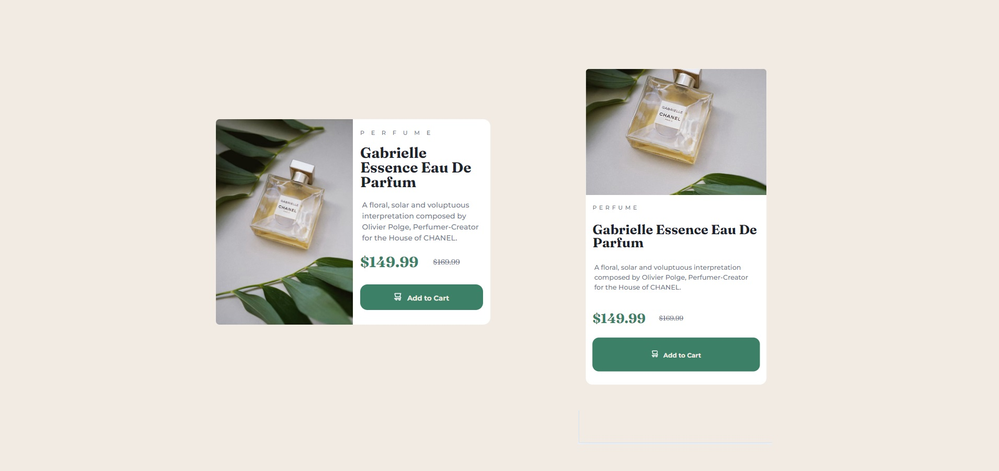

# Product preview card component

## Table of contents

- [Overview](#overview)
  - [Screenshot](#screenshot)
  - [Links](#links)
- [My process](#my-process)
  - [Built with](#built-with)
  - [What I learned](#what-i-learned)
  - [Useful resources](#useful-resources)
- [Author](#author)

## Overview

This is a component in which users can view the optimal layout depending on their device's screen size by using reponsive design elements, and see hover and focus states for interactive elements.

### Screenshot

### Links

- Solution URL: [Github](https://github.com/i-prkr/recipe-page)
- Live Site URL: [Github Pages](https://i-prkr.github.io/product-preview-card/)

## My process

### Built with

- Semantic HTML5 markup
- CSS custom properties
- CSS Grid
- Mobile-first workflow
- Responsive Design

### What I learned

This component was a great opportunity to become more familiar with responsive design, working with CSS grid, media queries, inline and block size and the clamp() function for dynamic typography. I was also able to learn the <picture> element and repsonsive images.

### Useful resources

- [Web.dev Responsive Design](https://web.dev/learn/design)
- [MDN Docs: Responsive Images](https://developer.mozilla.org/en-US/docs/Learn/HTML/Multimedia_and_embedding/Responsive_images)

## Author

- Frontend Mentor - [@i-prkr](https://www.frontendmentor.io/profile/i-prkr)
- Github - [Github](https://github.com/i-prkr)
